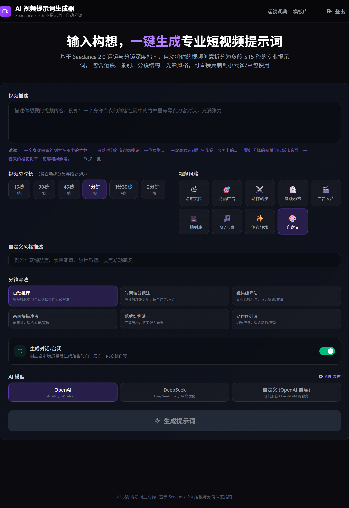

# 🎬 AI 短视频提示词生成器

专为 **Seedance 2.0**（字节跳动 AI 视频生成模型）设计的提示词生成工具。输入视频创意描述，AI 自动拆分为多段 ≤15 秒的专业分镜提示词，包含运镜指令、景别控制、光影风格和稳定性约束词，可直接用于 Seedance 2.0 生成视频。



## ✨ 功能特性

- **AI 自动分镜** — 根据总时长（15s ~ 2min）自动拆分为每段 ≤15 秒的独立提示词
- **9 种视频风格** — 治愈氛围、商品广告、动作武侠、悬疑恐怖、广告大片、一镜到底、MV 卡点、创意转场、自定义
- **5 种分镜写法** — 时间轴分镜法、镜头编号法、画面块描述法、幕式结构法、动作序列法（+ 自动推荐）
- **九宫格分镜图提示词** — 额外生成可用于豆包 / 即梦等 AI 图片工具的分镜参考图提示词
- **流式输出** — SSE 流式响应，逐步显示生成内容
- **运镜词典** — 完整的运镜、景别、分镜写法参考手册（基础 7 种 + 进阶 6 种 + 高级 8 种）
- **模板库** — 12 个精选提示词模板，覆盖多种视频类型
- **多模型支持** — OpenAI / DeepSeek / 任意 OpenAI 兼容 API
- **一键复制** — 每段单独复制或全部批量复制
- **设置持久化** — API Key 等配置保存在浏览器 localStorage

## 🛠 技术栈

| 技术 | 版本 |
|------|------|
| [Next.js](https://nextjs.org) (App Router) | 16 |
| [React](https://react.dev) | 19 |
| [TypeScript](https://www.typescriptlang.org) | 5 |
| [Tailwind CSS](https://tailwindcss.com) | 4 |
| [OpenAI SDK](https://www.npmjs.com/package/openai) | 6 |

## 🚀 快速开始

### 1. 克隆项目

```bash
git clone https://github.com/verysun/seedance-video-prompt-generation.git
cd seedance-video-prompt-generation
```

### 2. 安装依赖

```bash
npm install
# 或
pnpm install
```

### 3. 配置环境变量

复制 `.env.example`（如有）或新建 `.env.local` 文件，填入 AI 模型配置：

```env
# OpenAI（三选一即可）
OPENAI_API_KEY=sk-xxx
OPENAI_BASE_URL=              # 可选，默认官方地址
OPENAI_MODEL=gpt-4o           # 可选，默认 gpt-4o

# DeepSeek
DEEPSEEK_API_KEY=sk-xxx
DEEPSEEK_MODEL=deepseek-chat  # 可选，默认 deepseek-chat

# 自定义 OpenAI 兼容 API
CUSTOM_API_KEY=sk-xxx
CUSTOM_BASE_URL=https://your-api.com/v1
CUSTOM_MODEL=gpt-4o           # 可选，默认 gpt-4o
```

> 💡 也可以在前端界面直接输入 API Key / Base URL / Model，前端设置优先于环境变量。

### 4. 启动开发服务器

```bash
npm run dev
```

打开 [http://localhost:3000](http://localhost:3000) 即可使用。

## 📖 页面说明

| 路由 | 页面 | 说明 |
|------|------|------|
| `/` | 首页（生成器） | 输入视频创意描述 → 选择时长 / 风格 / 分镜写法 / AI 模型 → 生成提示词 |
| `/dictionary` | 运镜词典 | 完整的运镜表格、运镜组合公式、六级景别体系、五种分镜写法、节奏分配参考 |
| `/templates` | 模板库 | 12 个按类别筛选的提示词模板，支持一键复制 |

## 📁 项目结构

```
assets/                        # README 手册资源（截图等）
public/                        # 静态资源（图标等）
src/
├── app/
│   ├── page.tsx               # 首页（提示词生成器）
│   ├── layout.tsx             # 全局布局
│   ├── globals.css            # 全局样式
│   ├── api/generate/route.ts  # AI 生成 API（SSE 流式）
│   ├── dictionary/page.tsx    # 运镜词典页
│   └── templates/page.tsx     # 模板库页
├── components/
│   ├── ProviderSelector.tsx   # AI 模型选择器 + API 配置面板
│   ├── StyleSelector.tsx      # 视频风格选择器
│   ├── StoryboardMethodSelector.tsx  # 分镜写法选择器
│   ├── DurationPicker.tsx     # 视频时长选择器
│   ├── PromptCard.tsx         # 单段提示词展示卡片
│   ├── GridPromptCard.tsx     # 九宫格分镜图提示词卡片
│   ├── CopyButton.tsx         # 通用复制按钮
│   └── LoadingState.tsx       # 加载骨架屏动画
└── lib/
    ├── system-prompt.ts       # Seedance 2.0 提示词知识体系
    └── ai-providers/
        ├── index.ts           # AI 提供商统一入口
        ├── types.ts           # 类型定义
        ├── openai.ts          # OpenAI / 自定义兼容 API
        └── deepseek.ts        # DeepSeek API
```

## 🚢 部署

推荐使用 [Vercel](https://vercel.com) 一键部署：

[](https://vercel.com/new?utm_medium=default-template&filter=next.js)

部署时在 Vercel 项目设置中添加对应的环境变量即可。

也可使用任何支持 Node.js 的平台：

```bash
npm run build
npm start
```

## 📜 许可证

MIT
